[STEP1へ](step1.md)

# 2-1 ワークスペースの作成

**ハンバーガーメニュー**から **＋ 新しいワークスペース**をクリックします。

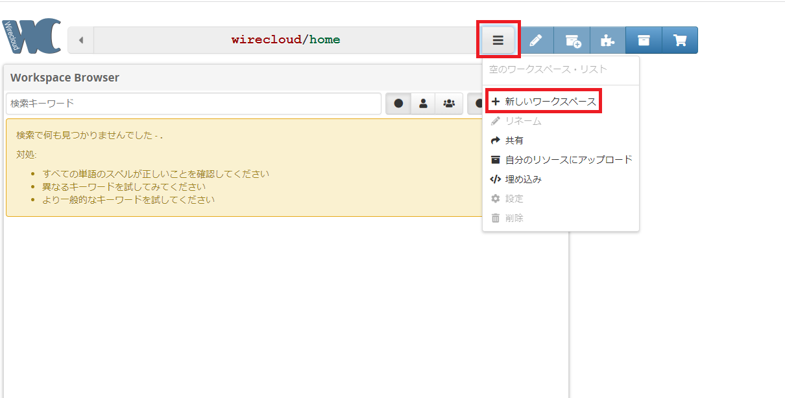

**名前**にワークスペース名を入力し、**設定ボタン**をクリックします。

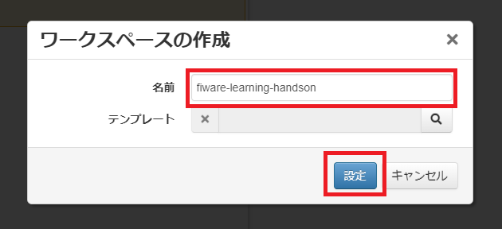

# 2-2 ウィジェットの追加

次にウィジェットを追加します。
ウィジェットはWireCloudにおいて画面を構成するために必要なコンポーネントとなっており、外部からダウンロードしたウィジェットをWireCloudへアップロードすることで使うことができます。
今回は以下のウィジェットを使用します。 以下のリンクからすべてのウィジェットをダウンロードします。

- [ol3-map-widget](https://github.com/Wirecloud/ol3-map-widget) ([ダウンロード](https://github.com/Wirecloud/ol3-map-widget/releases/download/1.2.3/CoNWeT_ol3-map_1.2.3.wgt))
- [ngsi-source-operator](https://github.com/wirecloud-fiware/ngsi-source-operator) ([ダウンロード](https://github.com/wirecloud-fiware/ngsi-source-operator/releases/download/4.2.0/CoNWeT_ngsi-source_4.2.0.wgt))
- [ngsi-entity2poi-operator](https://github.com/wirecloud-fiware/ngsi-entity2poi-operator) ([ダウンロード](https://github.com/wirecloud-fiware/ngsi-entity2poi-operator/releases/download/v3.2.2/CoNWeT_ngsientity2poi_3.2.2.wgt))


**マイ・リソースボタン**をクリックします。

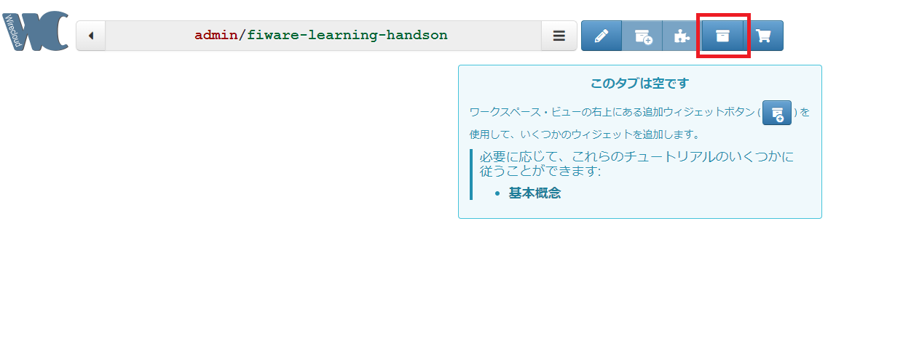

次に**アップロードボタン**をクリックします。

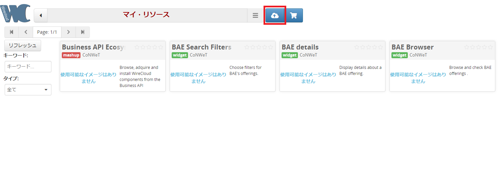

ダウンロードしたウィジェットを画面にドラッグ&ドロップすることで追加できます。ファイルの追加ができたら**アップロードボタン**をクリックします。

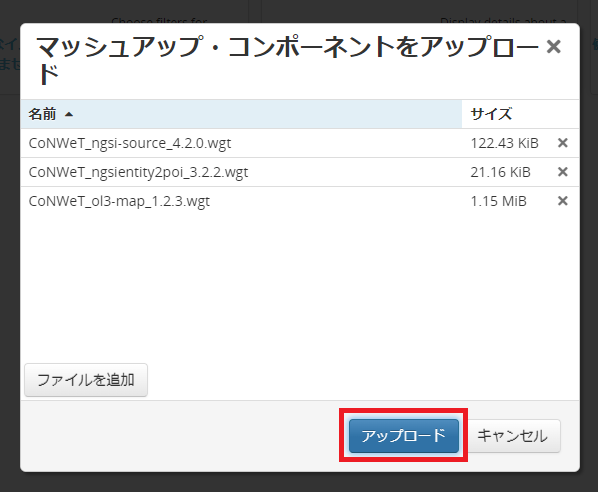

画面上部の**戻るボタン**をクリックし、ワークスペース画面に戻ります。


# 2-3 ワイヤーリングで画面を作成

**編集ボタン**をクリックすると、ワイヤーリングなど画面の編集ができるようになります。

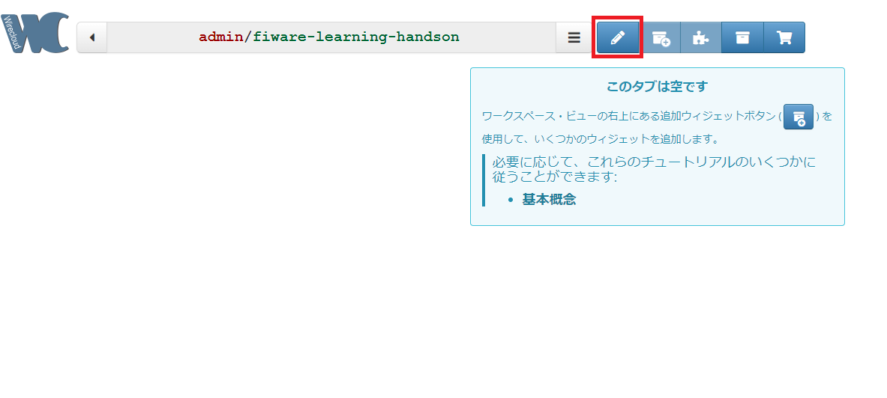

次に**ワイヤーリングボタン**をクリックします。

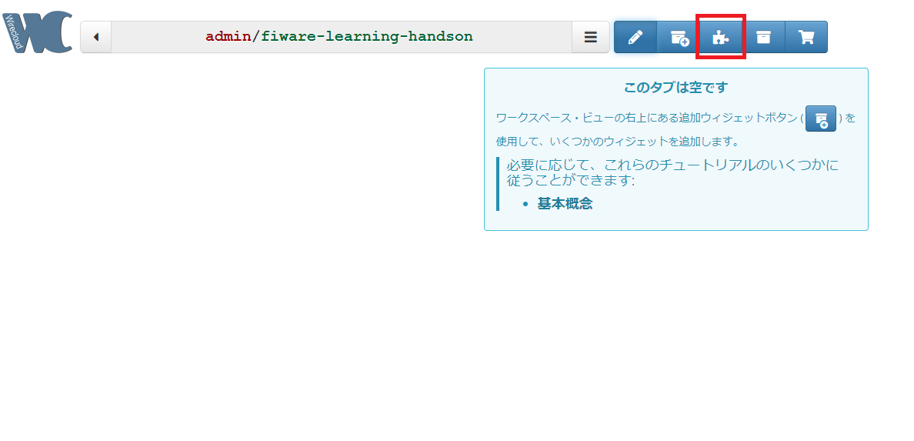

次に**コンポーネントの検索ボタン**をクリックします。

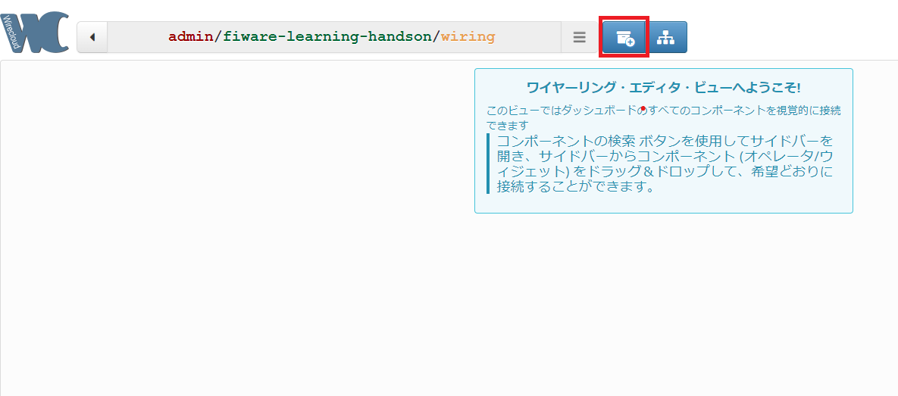

OpenLayers Mapの **+ボタン**をクリックすると、下にオレンジのボックスが作成されます。そのボックスを右側の空白にドラッグ&ドロップします。

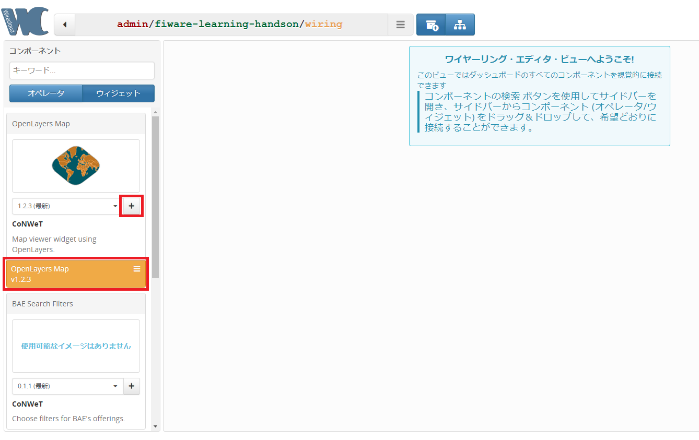

青色のタブから**オペレーター**に切り替えます。

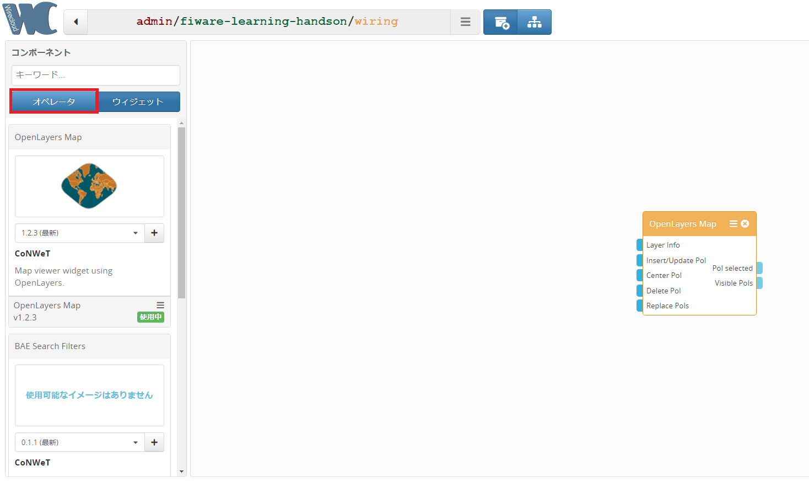

NGSI SourceとNGSI Entity To PoIも同じように **+ボタン**をクリックし、作成された緑色の箱を右側の空白にドラッグ&ドロップします。

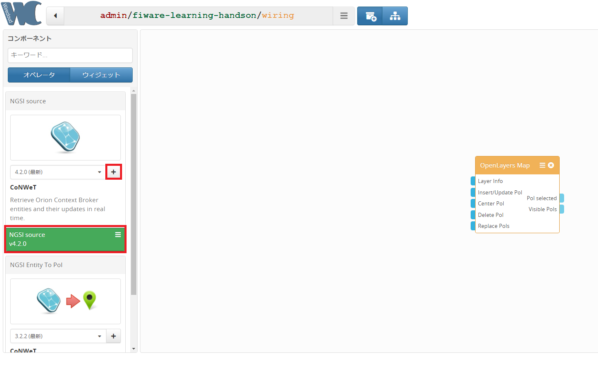

以下のようにウィジェットの接続を行います。
接続の方法は出っ張っている青色のコネクタを接続先のコネクタへドラッグ&ドロップします。

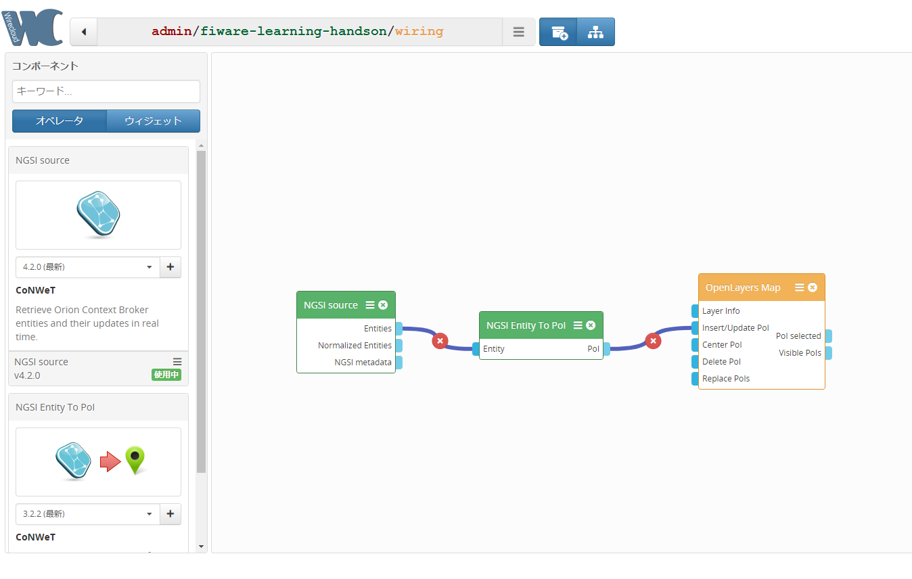

# 2-4 ポートの公開設定

ここで一度Codespacesの画面に戻り、後述するデータのリアルタイム更新に必要な設定を行います。  
※この設定はNGSI Sourceの設定の前に行う必要があります

**ポートタブ**をクリックします。

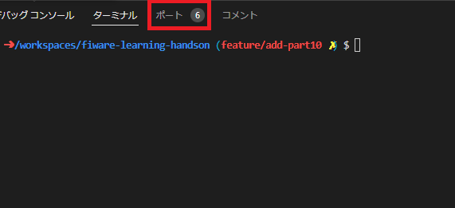

**ポート8100**の行で右クリックし、表示されたメニューから**ポートの表示範囲**にカーソルを合わせ、さらに表示されたメニューから**public**を選択します。


# 2-5 Orionとの接続設定

Wirecloudの画面に戻り、NGSI Sourceの**ハンバーガーメニュー**をクリックします。表示されたメニューから**設定**をクリックします。

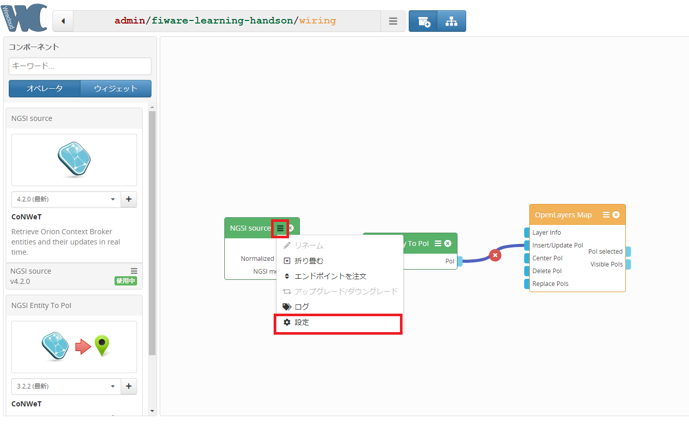

オペレータの設定を以下のように入力し**設定ボタン**をクリックします。

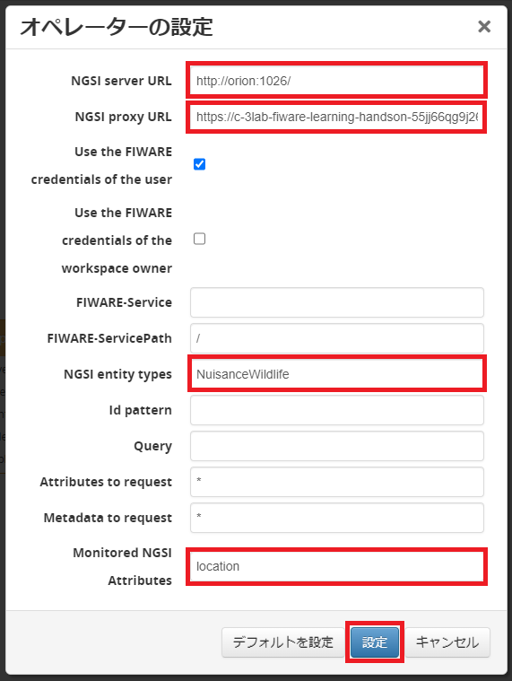

入力する値は以下をコピー&ペーストします。

NGSI server URL: `http://orion:1026/`  
NGSI proxy URL: ※1 ※2  
NGSI entity types: `NuisanceWildlife`  
Monitored NGSI Attributes: `location`

※1 **NGSI proxy URL**にはCodespacesの画面からコピーした値を設定します。**ポート8100**の行にカーソルを合わせると表示される、赤枠のアイコンをクリックし、値をコピーします。

※2 ローカル環境の場合、**NGSI Proxy URL**にはDockerネットワーク内のホスト名を指定します。但し、ブラウザからNGSI Proxyに対して通信を行う際に同じURLを利用するため、hostsファイルを編集するなどして、Dockerネットワーク内のホスト名で`127.0.0.1`に繋がるように設定する必要があります。(OS毎に手順は異なります)


オペレータの設定の内、赤枠の項目の説明は以下の通りです。
|項目名|説明|
|-|-|
|NGSI server URL|エンティティ情報を取得するOrionのURLを設定します。|
|NGSI proxy URL|変更通知を受け取るために使用するプロキシのURLを設定します。|
|NGSI entity types|Orionから取得するエンティティをフィルタリングするために、エンティティのタイプをカンマ区切りで設定します。|
|Monitored NGSI Attributes|Orionの更新を検知するために監視する属性を設定します。この項目を設定することで、自動でOrionにサブスクリプションが作成されます。設定しなかった場合、サブスクリプションは作成されません。|

画面上部の**戻るボタン**をクリックし、ワークスペース画面に戻ります。

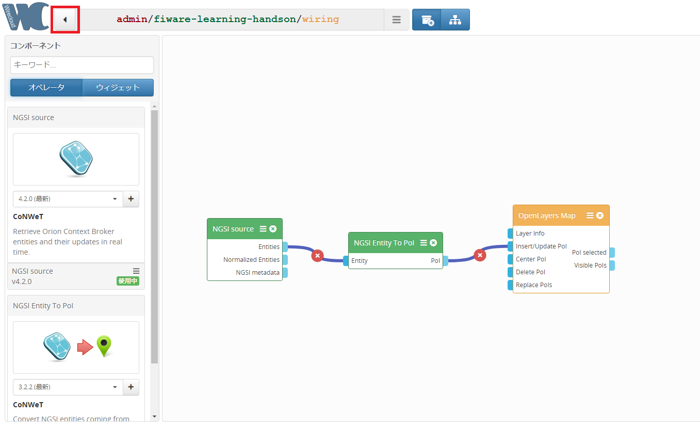

# 2-6 可視化の確認

サンプルデータとして登録した情報が地図上にピンとして表示されています。ピンを押すと吹き出しが表示され詳細情報を見ることもできます。

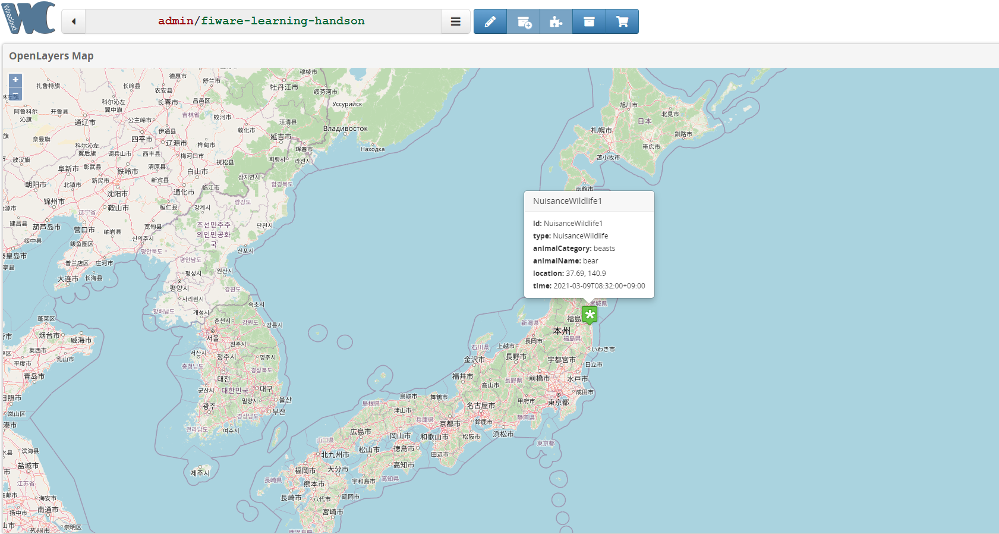

OrionのEntityを更新するとリアルタイムで更新が反映されます。

クマが移動したことを想定して、Entityのlocationの値を更新してみましょう。

以下のコマンドを実行し、locationを更新します。

```
curl localhost:1026/v2/entities/NuisanceWildlife1/attrs -s -S -H 'Content-Type: application/json' -X PATCH -d @- <<EOF
{
  "location": {
    "value": "37.99, 140.3",
    "type": "geo:point"
  }
}
EOF
```

以下のコマンドを実行し、locationが更新されていることを確認します。

```
curl localhost:1026/v2/entities | jq
```

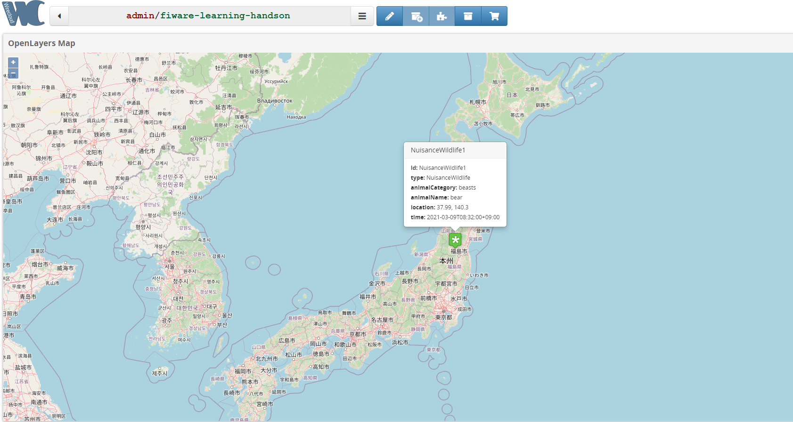

地図上のピンが移動していることを確認します。

[STEP3へ](step3.md)
