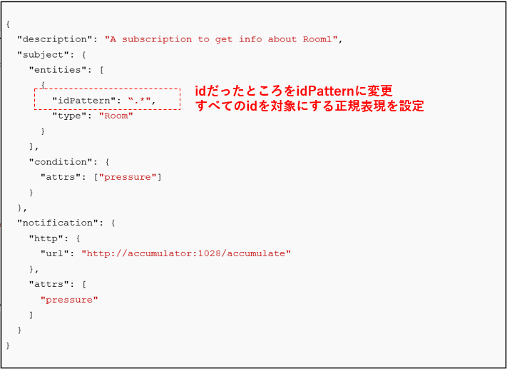

[STEP1へ](step1.md)

Orion Subscriptionにおける様々な設定に関して学習していきます。


# 2-1 idPatternによる検知対象の指定

変更を検知するEntityの指定方法にidPatternを使うことができます。  
idPatternは正規表現を使用しマッチしたEntityを対象とすることができます。



今回の例では".\*"を指定することで全てのidを対象にしています。

元のTerminalで以下のコマンドを実行します。

```json
curl -v -X PATCH localhost:1026/v2/subscriptions/${SUBSCRIPTION_ID} -s -S -H 'Content-Type: application/json' -d @- <<EOF
{
  "description": "A subscription to get info about Room",
  "subject": {
    "entities": [
      {
        "idPattern": ".*",
        "type": "Room"
      }
    ],
    "condition": {
      "attrs": ["pressure"]
    }
  },
  "notification": {
    "http": {
      "url": "https://accumulator:1028/accumulate"
    },
    "attrs": [
      "pressure"
    ]
  }
}
EOF
```

pressureの値を変更してみます。

`curl localhost:1026/v2/entities/Room1/attrs/pressure/value -s -S -H 'Content-Type: text/plain' -X PUT -d 730`

**Terminal2**を開きログを確認してみます。
先ほどと同じように通知された結果が確認できます。

他にも様々な条件や設定で通知を行うことができます。詳細は公式の[ngsiv2_implementation_note](uhttps://github.com/telefonicaid/fiware-orion/blob/master/doc/manuals/user/ngsiv2_implementation_notes.md#subscription-payload-validations)に記載されています。

### Subscriptionの設定

起動したmongodbとorionのコンテナを停止・削除します。

1. 以下コマンドでコンテナを停止・削除します。

   `docker-compose -f fiware-part3/assets/docker-compose.yml down`

2. 完了したら以下のコマンドでコンテナが停止・削除されていることを確認します。

   `docker ps -a`

   一覧に何も表示されていなければ成功です。

[終了](finish.md)
