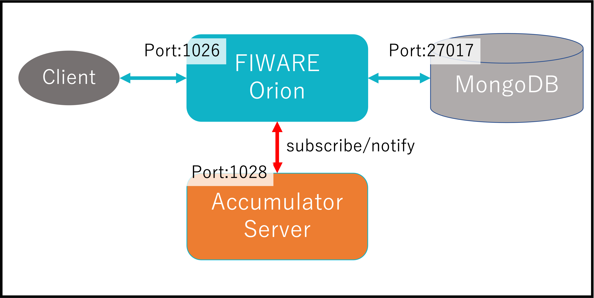
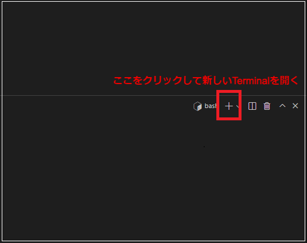
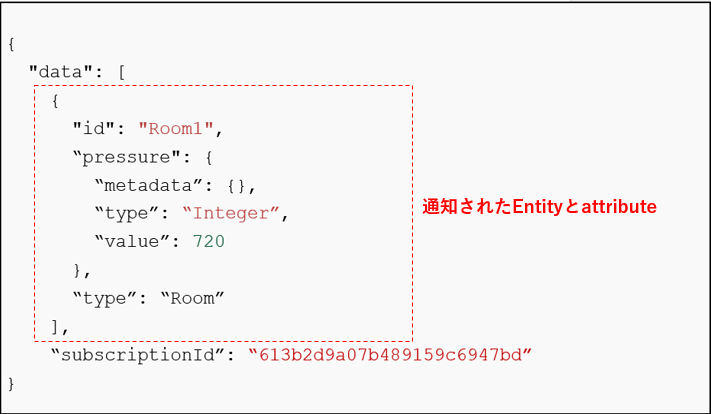
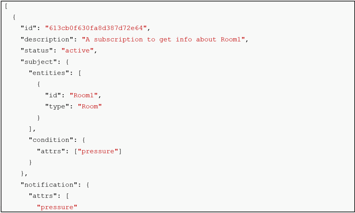

[STEP1へ](step1.md)

# 2-1 通知先のサンプルアプリを起動

Subscriptionの設定をする前に通知先の[FIWAREが公開しているサンプルアプリ](https://github.com/telefonicaid/fiware-orion/blob/master/scripts/accumulator-server.py)を起動します。



サンプルアプリを動作させるため、新しいTerminalを開きます。



**Terminal2**で以下のコマンドを実行し[FIWAREが公開しているサンプルアプリ](https://github.com/telefonicaid/fiware-orion/blob/master/scripts/accumulator-server.py)を起動します。

`docker exec -it accumulator bash`

`./accumulator-server.py --port 1028 --url /accumulate --pretty-print -v`

これはhttpでアクセスしてきた情報をログとして表示するサーバです。  
このアプリを使ってOrionからの通知の内容を確認していきます。


# 2-2 Subscriptionの設定

**元のTerminal**に戻ります。  
以下のコマンドでSubscriptionの設定を行います。


```json
curl -v localhost:1026/v2/subscriptions -s -S -H 'Content-Type: application/json' -X POST -d @- <<EOF
{
  "description": "A subscription to get info about Room1",
  "subject": {
    "entities": [
      {
        "id": "Room1",
        "type": "Room"
      }
    ],
    "condition": {
      "attrs": ["pressure"]
    }
  },
  "notification": {
    "http": {
      "url": "http://accumulator:1028/accumulate"
    },
    "attrs": [
      "pressure"
    ]
  }
}
EOF
```


pressureの値を変更してみます。

`curl localhost:1026/v2/entities/Room1/attrs/pressure/value -s -S -H 'Content-Type: text/plain' -X PUT -d 720`

**Terminal2**を開きログを確認してみます。  
通知された結果が以下のように出力されています。



# 2-3 Subscirptionの確認

`/v2/subscriptions`に対してGETすることでsubscirptionの一覧を取得できます。

`curl localhost:1026/v2/subscriptions | jq`

先ほど作成したsubscriptionにidが作成されていることが確認できます。



次のstepでsubscriptionの更新を行うので環境変数にsubscriptionのidを設定しておきます。  
以下のコマンドの = 以降に先ほど取得したsubscription idをコピー&ペーストして実行します。  

```
SUBSCRIPTION_ID=取得したsubscription id
```

このidを使用し`/v2/subscriptions/{id}`のように指定することで、PATCHで更新、DELETEで削除を行うことができます。

[STEP3へ](step3.md)
