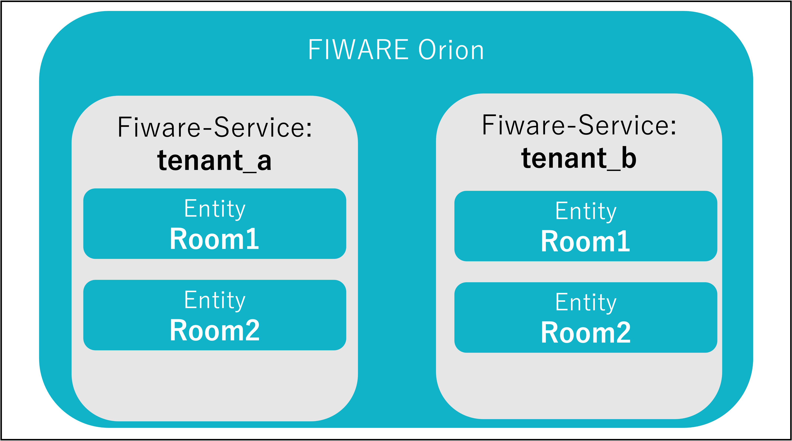

Part5ではFiware-ServiceとFiware-ServicePathについて学習します。

# 1-1 構成の起動

今回は以下の構成を起動します。

今回はdocker-composeにより以下の内容が構築されます。
※今回はFIWAREの学習がメインなので[docker-compose](https://docs.docker.jp/compose/toc.html)の説明については割愛します。

* FIWARE Orion
* MongoDB

以下のコマンドを実行します。

`./fiware-part5/setup.sh `

# 1-2 FIWARE-Serviceによるマルチテナンシーについて

FIWARE には論理的にデータベースを分離するマルチテナンシーの機能があります。  
FIWAREセキュリティフレームワーク(PEP proxy, IDM, Access Control)のようなコンポーネントで認可ポリシーの実現などを容易に実現します。

※ 図では省略してますがFiware-ServiceおよびEntityはMongoDB内で管理されています。

テナントが分かれていればRoom1とRoom2という重複したEntityIDでも登録が可能で、他のテナントからは取得などができなくなります。

[STEP2へ](step2.md)
