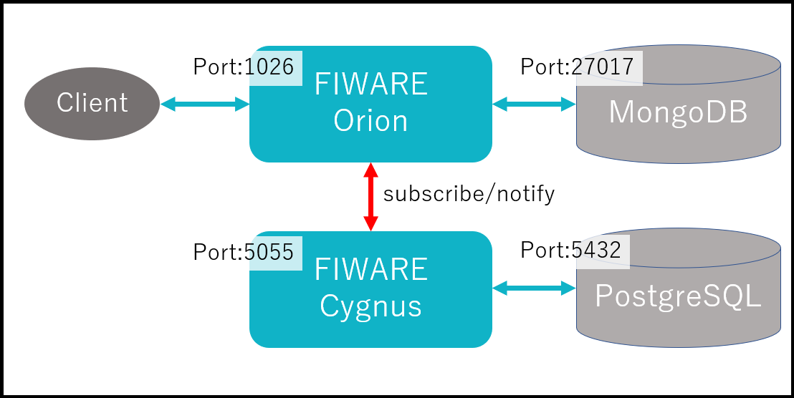

Part7ではFIWARE Orionのログ設定について学習していきます。

# Orionの概要


# 1-1 構成の起動

今回は以下の構成を起動します。



以下のコマンドを実行します。

```
docker-compose -f fiware-part7/assets/docker-compose.yml up -d
```

ターミナルの処理が終了したら以下のコマンドで起動していることを確認します。

```
docker ps
```

一覧に**fiware-orion**, **db-mongo**, **fiware-cygnus**, **db-postgres**があれば成功です。

# 1-2 ログの出力先

デフォルトのログファイルの出力先は`/tmp/contextBroker.log`です。

ログファイルが保存されているディレクトリ(デフォルトでは`/tmp`)は、**-logDir**コマンドライン引数を使用して変更することができます。

ただし、Dockerを用いてOrion([fiware/orion](https://hub.docker.com/r/fiware/orion))を起動している場合、Dockerのベストプラクティスに従ってログは標準出力に出力され、ファイルには出力されません。

# 1-3 ログの概要解説

FIWARE Orionから出力されるログ形式は、[Splunk](http://www.splunk.com/)や[Fluentd](http://www.fluentd.org/)などのツールでの利用を想定した設計になっています。

ログファイルの各行は、パイプ文字（`|`）で区切られたいくつかのKey-Valueフィールドで構成されています。


各行のフィールドは以下の通りです。

|フィールド|説明|
|-|-|
|**time**|ログの行が生成された瞬間のタイムスタンプ（[ISO8601](https://es.wikipedia.org/wiki/ISO_8601)形式）です|
|**lvl**|FATAL、ERROR、WARN、INFO、DEBUG、SUMMARYの6つのレベルがあります。<br>SUMMARYは`-logSummary`オプションを付与した場合にのみ出力される特別なレベルになります。|
|**corr (correlator id)**|ログ1行に対して一意に割り当てられるIDです。|
|**trans (transaction id)**|トランザクションに対して一意に割り当てられるIDです。<br>以下2種類のトランザクションがあります。<br>・Orionが公開するREST APIを外部クライアントが呼び出す際に開始されるトランザクション<br>・Orionが通知(Subscription)を送信する際に開始されるトランザクション|
|**from**|トランザクションに関連付けられたHTTPリクエストのソースIPです。<br>※リクエストに`X-Forwarded-For`ヘッダー、`X-Real-IP`ヘッダーが含まれている場合、それらのヘッダーが優先されて出力されます|
|**srv**|`fiware-service`ヘッダーの値が入ります。|
|**subsrv**|`fiware-servicepath`ヘッダーの値が入ります。|
|**comp (component)**|現在のOrionのバージョンでは、このフィールドは常に「orion」が使用されます。|
|**op**|ログメッセージを生成したソースコード内の関数です。|
|**msg (message)**|実際のログメッセージです。|

# 1-4 Orionが公開するREST APIを呼び出す際のログ

データ投入時のログ出力を確認します。

以下のコマンドを実行し、データを登録します。

```json
curl localhost:1026/v2/entities -s -S -H 'Content-Type: application/json' -X POST -d @- <<EOF
{
  "id": "Room1",
  "type": "Room",
  "temperature": {
     "value": 23.3,
     "type": "Float",
     "metadata": {}
  },
  "pressure": {
     "value": 711,
     "type": "Integer",
     "metadata": {}
  }
}
EOF
```

以下のコマンドを実行し、ログを確認します。

```
docker logs fiware-orion
```


`/v2/entities`へのPOSTリクエストを受信したことがログに記録されています。  
また、request payloadには受信したデータが記録されており、response codeとしてAPIの返したステータスコードが記録されています。

# 1-5 Orionが通知(Subscription)を送信する際のログ

Cygnusへの通知(Notification)時のログ出力を確認します

以下のコマンドを実行し、Subscriptionを登録します。

```json
curl -v localhost:1026/v2/subscriptions -s -S -H 'Content-Type: application/json' -X POST -d @- <<EOF
{
  "description": "A subscription to get info about Room",
  "subject": {
    "entities": [
      {
        "idPattern": ".*",
        "type": "Room"
      }
    ],
    "condition": {
      "attrs": ["temperature"]
    }
  },
  "notification": {
    "http": {
      "url": "http://cygnus:5055/notify"
    },
    "attrs": [
      "temperature"
    ]
  }
}
EOF
```

以下のコマンドを実行し、temperatureの値を変更します。

```
curl localhost:1026/v2/entities/Room1/attrs/temperature/value -s -S -H 'Content-Type: text/plain' -X PUT -d 29.5
```

以下のコマンドを実行し、ログを確認します。

```
docker logs fiware-orion
```


`cygnus:5055/notify`へのPOSTリクエストを送信したことがログに記録されています。  
また、response codeとして通知先が返したステータスコードが記録されています。

# 1-6 コマンドライン引数で設定できるログ設定

コマンドライン引数で設定できるパラメータには以下のものがあります。

|コマンドライン引数|説明|
|-|-|
|**-logDir \<dir>**|ログファイル出力先ディレクトリを指定します。|
|**-logAppend**|指定した場合、空のログファイルで開始するのではなく、既存のログファイルに追記されます。|
|**-logLevel**| ・NONE (致命的なエラーメッセージを含むすべてのログを出力しません)<br>・FATAL (致命的なエラーメッセージのみ出力します)<br>・ERROR (致命的なエラーメッセージおよびエラーメッセージを出力します)<br>・WARN (致命的なエラーメッセージ、エラーメッセージおよび警告メッセージを出力します、デフォルトの設定)<br>・INFO (致命的なエラーメッセージ、エラーメッセージ、警告メッセージおよび情報メッセージを出力します)<br>・DEBUG (すべてのメッセージを出力します)<br>  [ログレベルは管理API](https://fiware-orion.readthedocs.io/en/latest/admin/management_api.html)を使用して実行時に変更することができます。|
|**-logSummary**|ログの要約トレースを有効にできます。詳細については、[ログのドキュメント](https://fiware-orion.readthedocs.io/en/latest/admin/logs.html#summary-traces)を参照してください。|
|**-relogAlarms**|トリガー条件が発生するたびにログを出力します。詳細については、[ログのドキュメント](https://fiware-orion.readthedocs.io/en/latest/admin/logs.html#alarms)を参照してください。|
|**-logForHumans**|人間が見やすいように整形されたログを出力します。|

# 1-7 コンテナの停止・削除

起動したコンテナを停止・削除します。

1. 以下コマンドでコンテナを停止・削除します。

   `docker-compose -f fiware-part7/assets/docker-compose.yml down`

2. 完了したら以下のコマンドでコンテナが停止・削除されていることを確認します。

   `docker ps -a`

   一覧に何も表示されていなければ成功です。

[終了](finish.md)
