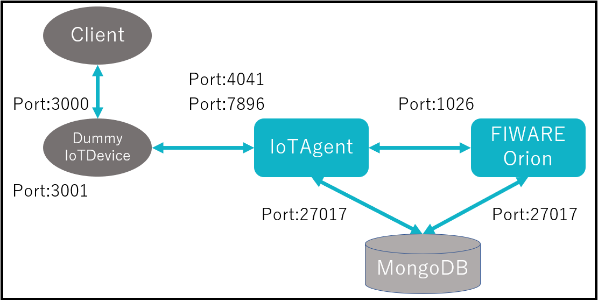
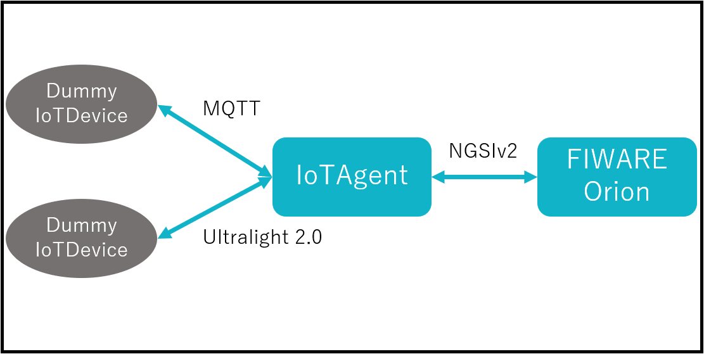

part8ではIoTAgentを使ったデバイスからのデータ収集について学習していきます。

# 1-1 IoTAgentの概要


# 1-2 構成の起動

今回は以下の構成を起動します。



以下のコマンドを実行します。

```
docker-compose -f fiware-part8/assets/docker-compose.yml up -d
```

ターミナルの処理が終了したら以下のコマンドで起動していることを確認します。

```
docker ps
```

一覧に**fiware-orion**, **db-mongo**, **fiware-iot-agent**, **dummy-device**があれば成功です。

# 1-3 FIWARE IoTAgentの機能

IoTAgentは、IoTDevice固有のプロトコルを[NGSIv2](../fiware-part2/step2.md)（FIWARE標準データ交換モデル）に変換します。

IoTDeviceをFIWAREに接続する場合に必要となります。  
※IoTDeviceがNGSIAPIをネイティブにサポートしている場合、IoTAgentは必要ありません

### IoTDevice固有のプロトコルの例

|プロトコル|説明|
| - | - |
|MQTT|Publish/Subscribe モデルのメッセージングにより、非同期に1対多の通信ができるプロトコルです。シンプルかつ軽量に設計されているため、IoTの実現に適しています。|
|Ultralight 2.0|ネットワーク帯域幅やメモリが制限された、制約のあるデバイスとの通信を目的とした、テキストベースの軽量プロトコルです。|



[STEP2へ](step2.md)
