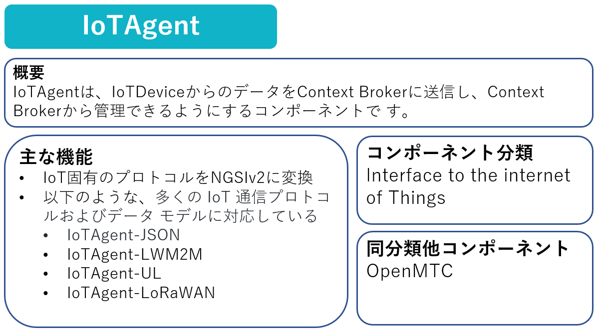
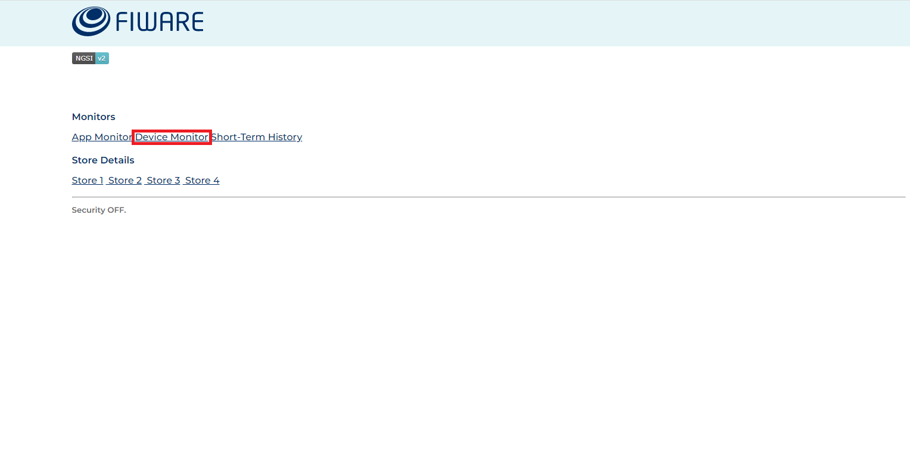
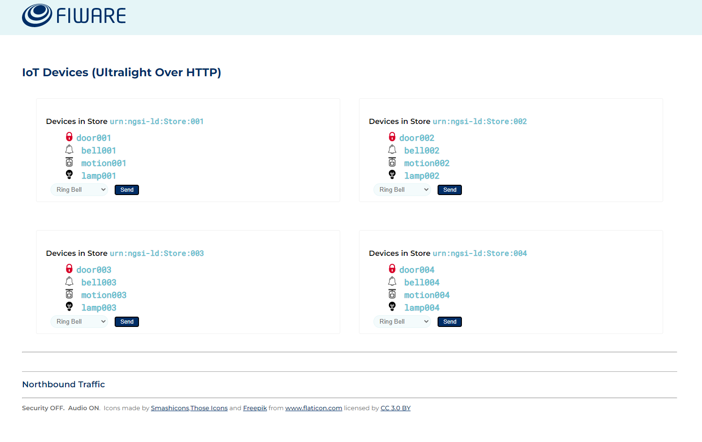
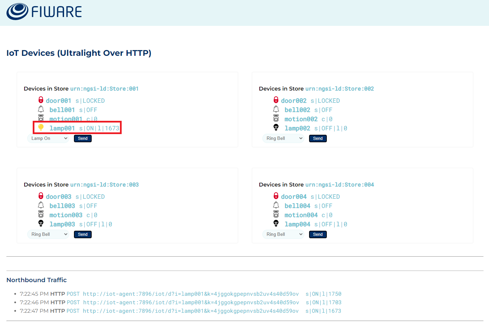
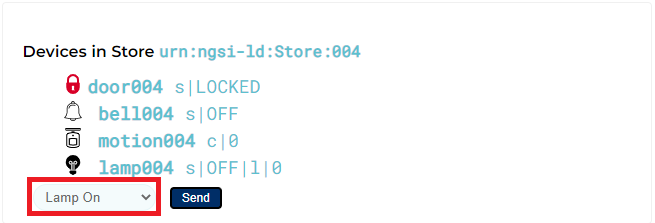
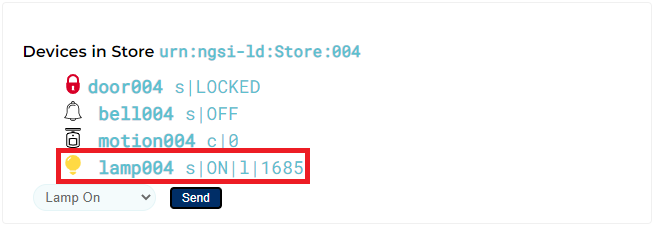
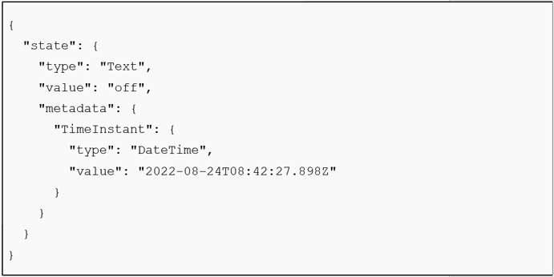

part8ではIoTAgentを使ったデバイスからのデータ収集について学習していきます。

# 1-1 IoTAgentの概要



# 1-2 構成の起動

今回は以下の構成を起動します。


以下のコマンドを実行します。

```
docker-compose -f fiware-part8/assets/docker-compose.yml up -d
```

ターミナルの処理が終了したら以下のコマンドで起動していることを確認します。

```
docker ps
```

一覧にfiware-orion, db-mongo, fiware-iot-agent, dummy-deviceがあれば成功です。

# 1-3 FIWARE IoTAgentの機能

IoTAgentは、IoTDevice固有のプロトコルを[NGSIv2](../fiware-part2/step2.md)（FIWARE標準データ交換モデル）に変換します。

IoTDeviceをFIWAREに接続する場合に必要となります。  
※IoTDeviceがNGSIAPIをネイティブにサポートしている場合、IoTAgentは必要ありません

### IoTDevice固有のプロトコルの例

|プロトコル|説明|
| - | - |
|MQTT|Publish/Subscribe モデルのメッセージングにより、非同期に1対多の通信ができるプロトコルです。シンプルかつ軽量に設計されているため、IoTの実現に適しています。|
|Ultralight 2.0|ネットワーク帯域幅やメモリが制限された、制約のあるデバイスとの通信を目的とした、テキストベースの軽量プロトコルです。|


# 1-4 仮想IoTDeviceを起動する

# 1-5 IoTAgentの設定

以下のコマンドを実行し、IoTAgentが正常に動作していることを確認します。

```
curl -X GET 'http://localhost:4041/iot/about' | jq
```


IoTAgentは、IoTDeviceとOrionとの間のミドルウェアとして機能し、IoTDeviceから送られてくる測定情報をOrionに登録します。この時、IoTAgentで`device id`から`Entity ID`への変換が行われます。

IoTDevice毎に設定されている`device id`の一意性が保証できない場合、`fiware-service` `fiware-servicepath`の2つのヘッダーを使用することで、IoTDeviceを識別するための条件を追加することができます。`fiware-service`にテナント名、部門などを、`fiware-servicepath`に分野、地域などを設定します。

`fiware-service` `fiware-servicepath`の詳細に関しては[Part5](../fiware-part5/step1.md)を参照してください。

`device id`の一意性が保証できない例としては、異なるメーカーのIoTDeviceを併用する場合などが挙げられます。

メーカーがFIWAREとの通信を想定した一意の`device id`を設定するとした場合、
メーカー単位では一意性が保証されるが、異なるメーカーのIoTDeviceを併用する場合は一意性が保証されません。

以下のコマンドを実行し、IoTDeviceからのデータをIoTAgentが受け付ける設定をします。

```
curl -iX POST \
  'http://localhost:4041/iot/services' \
  -H 'Content-Type: application/json' \
  -H 'fiware-service: openiot' \
  -H 'fiware-servicepath: /' \
  -d '{
 "services": [
   {
     "apikey":      "4jggokgpepnvsb2uv4s40d59ov",
     "cbroker":     "http://orion:1026",
     "entity_type": "Thing",
     "resource":    "/iot/d"
   }
 ]
}'
```

# 1-6 仮想IoTDeviceの説明

本Partでは以下の仮想IoTDeviceを使用します。

|デバイス名|機能説明|
|-|-|
|スマートドア|リモートでロックまたはロック解除するコマンドを送信できる電子ドアです。|
|ベル|コマンドに応答して、ベルを鳴らします。|
|モーションセンサー|コマンドには反応しませんが、スマートドアを通過する顧客の数を測定します。ドアのロックが解除されている場合、モーションセンサーは動きを検出し、測定値をIoTAgentに送ります。|
|スマートランプ|リモートでオンとオフを切り替えることができ、光度も記録します。内部にモーション センサー(※)が含まれており、動きが検出されないまま時間が経過するとゆっくりと暗くなります。|

※動きを検出し光度レベルを変化させるためのセンサー、同表のスマートドアのモーションセンサーとは別物

以下のコマンドを実行し、IoTAgent経由でMongoDBに上記デバイスのデータを登録します。

```
./fiware-part8/setup.sh
```

### 仮想IoTDeviceのGUIでの操作方法

以下の手順で仮想IoTDeviceの操作画面にアクセスします。

1. **ポートタブ**をクリックします。


2. **ポート3000**の行にカーソルを合わせると表示される、赤枠のアイコンをクリックします。


3. 画面の**Device Monitor**をクリックします。



4. 仮想IoTDeviceの操作画面が開かれます。



画面を開くと、店舗毎にデバイスが表示されています。各店舗のプルダウンからデバイスに対する操作を選択し、**Sendボタン**をクリックします。

※仮想IoTDevice004はIoTAgentにデバイスの登録を行っていないため、現時点では動作しません

# 1-7 仮想IoTDeviceを使用してのデータ更新

仮想IoTDevice001～003を使用して、データの更新を行います。

今回は、スマートランプ（lamp001)を例に操作を行っていきます。

インターネットを利用して、店舗の照明を外部から点けてみましょう。画面に表示されている店舗の内、`urn:ngsi-ld:Store:001`を確認します。左下のプルダウンから`Lamp On`を選択し、**Sendボタン**をクリックします。


### データ更新結果の確認

`lamp001`が`On`になっていることを確認します。



IoTDeviceが測定したデータが、IoTAgentを介してOrionに反映されていることを確認します。
以下のコマンドを実行し、Orionから`lamp001`のデータを取得します。

```
curl -X GET 'http://localhost:1026/v2/entities/urn:ngsi-ld:Lamp:001/attrs?attrs=state&type=Lamp' -H 'fiware-service: openiot' -H 'fiware-servicepath: /' | jq
```


取得したデータを確認すると、`state`の`value`が`ON`に更新されていることがわかります。

# 1-8 IoTAgentに仮想IoTDeviceを登録

IoTAgentにデバイス登録していないと、デバイスからのデータ送信をIoTAgentは受け付けません。そのため、現時点ではデバイス登録していない仮想IoTDevice004は画面上で操作をしても変化しません。

仮想IoTDevice004を使用できるようにするため、以下のコマンドを実行し、IoTAgentにデバイスを登録します。  
※画面上でデバイスの操作を行っている場合、`door004` `bell004` `motion004` `lamp004`が未知のデバイスとして自動的に登録されてしまいます。そのため、以下のコマンドではデバイスの削除をしてから登録を行います。

 1. スマートドアの削除
 ```
 curl -iX DELETE 'http://localhost:4041/iot/devices/door004' -H 'fiware-service:  openiot' -H 'fiware-servicepath: /'
 ```

2. スマートドアの登録
```
curl -iX POST \
  'http://localhost:4041/iot/devices' \
  -H 'Content-Type: application/json' \
  -H 'fiware-service: openiot' \
  -H 'fiware-servicepath: /' \
  -d '{
  "devices": [
    {
      "device_id": "door004",
      "entity_name": "urn:ngsi-ld:Door:004",
      "entity_type": "Door",
      "protocol": "PDI-IoTA-UltraLight",
      "transport": "HTTP",
      "endpoint": "http://dummy-device:3001/iot/door004",
      "commands": [
        {"name": "unlock","type": "command"},
        {"name": "open","type": "command"},
        {"name": "close","type": "command"},
        {"name": "lock","type": "command"}
       ],
       "attributes": [
        {"object_id": "s", "name": "state", "type":"Text"}
       ]
    }
  ]
}'
```

3. ベルの削除
```
curl -iX DELETE 'http://localhost:4041/iot/devices/bell004' -H  'fiware-service:   openiot' -H 'fiware-servicepath: /'
```

4. ベルの登録
```
curl -iX POST \
  'http://localhost:4041/iot/devices' \
  -H 'Content-Type: application/json' \
  -H 'fiware-service: openiot' \
  -H 'fiware-servicepath: /' \
  -d '{
  "devices": [
    {
      "device_id": "bell004",
      "entity_name": "urn:ngsi-ld:Bell:004",
      "entity_type": "Bell",
      "protocol": "PDI-IoTA-UltraLight",
      "transport": "HTTP",
      "endpoint": "http://dummy-device:3001/iot/bell004",
      "commands": [
        { "name": "ring", "type": "command" }
       ]
    }
  ]
}'
```

5. モーションセンサーの削除
```
curl -iX DELETE 'http://localhost:4041/iot/devices/motion004' -H 'fiware-service:   openiot' -H 'fiware-servicepath: /'
```

6. モーションセンサーの登録
```
curl -iX POST \
  'http://localhost:4041/iot/devices' \
  -H 'Content-Type: application/json' \
  -H 'fiware-service: openiot' \
  -H 'fiware-servicepath: /' \
  -d '{
 "devices": [
   {
     "device_id":   "motion004",
     "entity_name": "urn:ngsi-ld:Motion:004",
     "entity_type": "Motion",
     "timezone":    "Europe/Berlin",
     "attributes": [
       { "object_id": "c", "name": "count", "type": "Integer" }
     ]
   }
 ]
}'
```

7. スマートランプの削除
```
curl -iX DELETE 'http://localhost:4041/iot/devices/lamp004' -H 'fiware-service:   openiot' -H 'fiware-servicepath: /'
```

8. スマートランプの登録
```
curl -iX POST \
  'http://localhost:4041/iot/devices' \
  -H 'Content-Type: application/json' \
  -H 'fiware-service: openiot' \
  -H 'fiware-servicepath: /' \
  -d '{
  "devices": [
    {
      "device_id": "lamp004",
      "entity_name": "urn:ngsi-ld:Lamp:004",
      "entity_type": "Lamp",
      "protocol": "PDI-IoTA-UltraLight",
      "transport": "HTTP",
      "endpoint": "http://dummy-device:3001/iot/lamp004",
      "commands": [
        {"name": "on","type": "command"},
        {"name": "off","type": "command"}
       ],
       "attributes": [
        {"object_id": "s", "name": "state", "type":"Text"},
        {"object_id": "l", "name": "luminosity", "type":"Integer"}
       ]
    }
  ]
}'
```

各POSTリクエストの主な項目の説明は以下の通りです。

|項目名|説明|
|-|-|
|device_id|デバイスを識別するためのidを設定します。|
|entity_name|Orionに登録されるときの`Entity ID`を設定します。<br>各デバイスからULプロトコルで送られてきた`i`(`device_id`)から`entity_name`(`Entity id`)にマッピングされます。|
|entity_type|Orionに登録されるときの`Entity Type`を設定します。|
|endpoint|デバイスがコマンドを受け付けるendpointを設定します。|
|commands|デバイスに対して行える操作を設定します。|
|attributes|Orionに登録されるときの`Entity Attribute`を設定します。<br>各デバイスからULプロトコルで送られてきた`s`, `l`(`object_id`)などから`state`, `luminosity`(`name`)などにマッピングされます。|

# 1-9 仮想IoTDevice004の動作確認

1-8でIoTAgentに登録した仮想IoTDevice004が正常に動作することを確認します。

画面に表示されている店舗の内、`urn:ngsi-ld:Store:004`を確認します。左下のプルダウンから`Lamp On`を選択し、**Sendボタン**をクリックします。



`lamp004`が`On`になっていることを確認します。



# 1-10 デバイスからの通信内容

1-9で画面から操作した際にはデバイスからIoTAgentにリクエストが送られていました。この項では、手動でIoTAgentにリクエストを送ることで、デバイスからの通信内容を確認します。

以下の手順で、IoTAgentに直接コマンドを実行することで、仮想IoTDevice004からIoTAgentに送られている通信内容を確認します。

1. 以下のコマンドを実行し、IoTAgentに直接データを送信します。

```
curl -iX POST \
  'http://localhost:7896/iot/d?k=4jggokgpepnvsb2uv4s40d59ov&i=lamp004' \
  -H 'Content-Type: text/plain' \
  -d 's|off'
```

2. 以下のコマンドを実行し、Orionからデータを取得します。

```
curl -X GET 'http://localhost:1026/v2/entities/urn:ngsi-ld:Lamp:004/attrs?attrs=state&type=Lamp' -H 'fiware-service: openiot' -H 'fiware-servicepath: /' | jq
```



1-8で行ったデバイス登録により、実行コマンドの`s`が`state`にマッピングされています。今回は`Ultralight2.0`を使用しており、`state`が`s`になることにより、デバイスとIoTAgentとの間のデータ通信量を少なくできます。

※IoTAgentに対して定期的に仮想IoTDeviceの現在の状態が送信されるため、コマンド実行直後は`state`の`value`が`OFF`になっていますが、一定時間経過後は`ON`に更新されます

# 1-11 コンテナの停止・削除

起動したmongodbとorionのコンテナを停止・削除します。

1. 以下コマンドでコンテナを停止・削除します。

   `docker-compose -f fiware-part8/assets/docker-compose.yml down`

2. 完了したら以下のコマンドでコンテナが停止・削除されていることを確認します。

   `docker ps -a`

   一覧に何も表示されていなければ成功です。

[終了](finish.md)